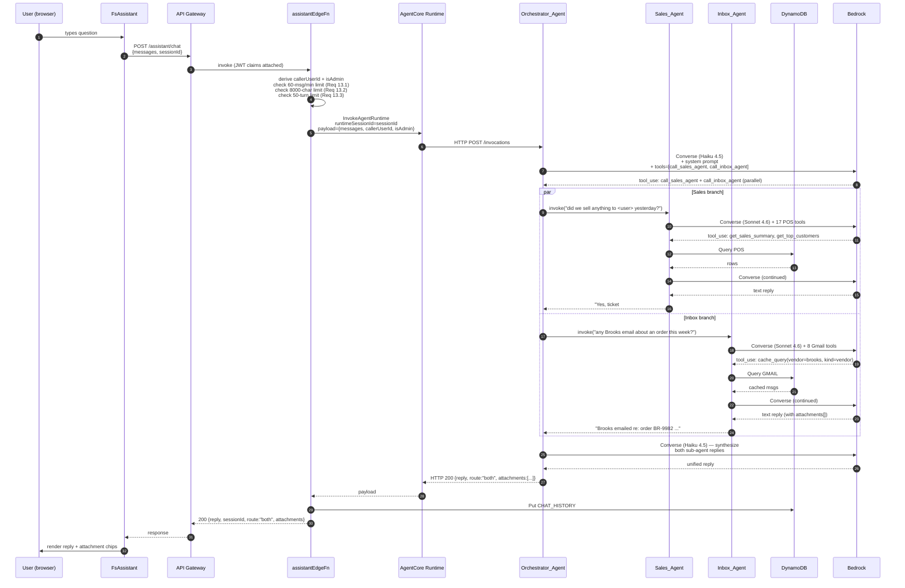

# Design Document

## Overview

The FS Assistant Orchestrator replaces the two page-scoped chatbots (`SalesChat` on `/sales` calling `POST /pos/chat`, `GmailChat` on `/gmail` calling `POST /gmail/chat`) with a unified, multi-agent assistant available on every authenticated page. A single endpoint `POST /assistant/chat` is fronted by a Strands-Agents-based **Orchestrator_Agent** running on **Amazon Bedrock AgentCore Runtime**. The orchestrator classifies intent and delegates to one or both of two specialist agents — **Sales_Agent** (Heartland POS data) and **Inbox_Agent** (Gmail data) — using Strands' agents-as-tools pattern.

### Key design decisions (resolved up front)

| # | Decision | Choice | Rationale |
|---|---|---|---|
| 1 | **Sub-agent runtime** | **Hybrid (Option C, refined)**: Orchestrator + Sales_Agent + Inbox_Agent are all **TypeScript Strands agents** co-deployed in **one** AgentCore Runtime container. The Sales_Agent and Inbox_Agent tool callbacks reuse the existing TypeScript tool implementations (`executeTool` from `lambda/chat/index.ts`, the cache helpers from `lambda/gmail-analysis/cache.ts`). | Strands ships a TypeScript SDK ([`@strands-agents/sdk`](https://github.com/strands-agents/sdk-typescript)) with the same `asTool()` agents-as-tools pattern as the Python SDK. Co-locating the three agents in one container keeps each turn to **two model calls** (orchestrator routing → one or both sub-agents) without inter-process latency, and lets us lift the existing TS DynamoDB / Gmail cache code as Strands tool callbacks instead of rewriting in Python. |
| 2 | **Endpoint shape** | `POST /assistant/chat` → existing API Gateway HTTP API → a thin TypeScript "edge" Lambda (`assistantEdgeFn`) → AgentCore `InvokeAgentRuntime` (sync, JSON, non-streaming for v1). | Keeps Cognito JWT auth, CORS, rate limiting, and admin-flag derivation in the Lambda — same shape as every other route. AgentCore's bearer-token / OAuth path is unnecessary since auth already terminates at API Gateway. Streaming is deferred to v2 (see "Open questions"). |
| 3 | **Routing model** | Strands agent loop with two sub-agent tools (`call_sales_agent`, `call_inbox_agent`) plus a system-prompt rule set. The orchestrator runs on Claude Haiku 4.5 (cheap+fast); sub-agents run on Claude Sonnet 4.6 (smart enough for tool reasoning). | Mirrors the existing `call_inbox_assistant` / `call_sales_assistant` cross-tool pattern in the current Lambdas — same mental model, less rope. |
| 4 | **Identity propagation** | `Caller_User_Id` and `isAdmin` flow through the AgentCore call as **JSON payload fields** (not headers), and each Strands sub-agent invocation gets them via `invocation_state` → `tool_context.invocation_state.user_id` / `is_admin`. | Strands `invocation_state` is the documented mechanism for per-call shared state across nested agents. Header-based propagation requires a custom AgentCore header allowlist that adds operational surface for no benefit. |
| 5 | **Conversation history** | The orchestrator-edge Lambda owns history. After each turn it persists `userId + sk = CHAT_HISTORY#assistant#<sessionId>` with a per-turn record `{ role, content, route, timestamp }`. Sub-agents are stateless across turns. | Single source of truth, single TTL, single retention rule. Routing decision is captured as a per-turn property so the UI / debugging can show "this turn went to Sales+Inbox". |
| 6 | **Frontend integration** | New `<FsAssistant />` component mounted **once** in `App.tsx` inside `ProtectedRoute` (so it appears on every protected route, never on `/login` or `/callback`). Existing `<SalesChat />` and `<GmailChat />` are removed from `SalesRevenue.tsx` and `GmailAnalysis.tsx` in the same release. State (open/closed, sessionId, messages) is held in a small Zustand store so it survives `<Outlet />` re-renders during navigation. | One bubble, one source of truth. Mounting inside `ProtectedRoute` is simpler than per-page conditional mount and avoids the double-bubble race during the migration window. |
| 7 | **IAM and CDK** | New CDK constructs: an `AgentCoreRuntime` L1 (`AWS::BedrockAgentCore::Runtime`), an ECR repo for the agent container, the `assistantEdgeFn` Lambda, the `/assistant/chat` route, and history routes. The execution role for the AgentCore container holds **all** business-data permissions (DynamoDB, Gmail secrets, Tavily, vector index) — the role is shared because the three Strands agents live in the same container, but each Strands agent's *tool list* enforces separation of duty inside the container. | The IAM "matrix" (Req 12) is partially enforced by IAM (the orchestrator Lambda has zero data permissions) and partially by Strands tool-list scoping (the in-process orchestrator agent has no DynamoDB tools attached even though the container role technically could call DynamoDB). This is documented in the IAM Matrix table below. |
| 8 | **Failure modes** | Per-sub-agent timeout via `Promise.race` (60s, Req 9.4); per-domain unavailable banner (Req 9.1, 9.2); both-down → HTTP 200 + plain text reply (Req 9.3); Bedrock throttling → exponential backoff in Strands' built-in retry (Req 9.5). | Strands has built-in retry; we wire the timeout ourselves because Strands' default tool-execution timeout is unbounded. |
| 9 | **Migration** | Both old endpoints stay live for one release. The new chat-history list endpoint queries three SK prefixes (`CHAT_HISTORY#sales#`, `CHAT_HISTORY#inbox#`, `CHAT_HISTORY#assistant#`) and labels legacy sessions with `"Sales (legacy)"` / `"Inbox (legacy)"`. Read-only — no migration of legacy session content. | Lowest-friction rollback. After 14 days of green telemetry, delete the two old routes and the page-scoped components. |
| 10 | **Observability** | AgentCore native observability (CloudWatch GenAI dashboard) + custom CloudWatch metrics emitted from the edge Lambda: `AssistantRouteCount{route=sales\|inbox\|both\|general}`, `SubAgentLatencyMs{agent=sales\|inbox}`, `OrchestratorTurnLatencyMs`. | The native AgentCore traces show the per-turn span tree (orchestrator → sub-agent calls). The custom metrics let us alarm on routing-distribution drift without parsing traces. |

---

## Architecture

### Component diagram

```mermaid
graph TB
    subgraph Browser["Browser (React SPA)"]
        FA[FsAssistant bubble<br/>mounted in ProtectedRoute]
        FA -->|POST /assistant/chat<br/>Cognito JWT| APIGW
    end

    subgraph AWS["AWS (us-east-1)"]
        APIGW[API Gateway HTTP API<br/>JWT authorizer]
        APIGW --> EDGE[assistantEdgeFn Lambda<br/>Node 20, 256 MB, 90s timeout<br/>• rate limit<br/>• 8000-char check<br/>• derive isAdmin<br/>• InvokeAgentRuntime<br/>• persist history]

        EDGE -->|InvokeAgentRuntime<br/>JSON payload| AGCR[AgentCore Runtime<br/>fs-assistant<br/>ARM64 container, Node 20<br/>Express + Strands SDK]

        subgraph Container["AgentCore container (single image)"]
            ORCH[Orchestrator_Agent<br/>Strands Agent<br/>model: Haiku 4.5<br/>tools: [salesAgent.asTool,<br/>inboxAgent.asTool]]
            ORCH -->|asTool call| SALES[Sales_Agent<br/>Strands Agent<br/>model: Sonnet 4.6<br/>tools: 17 POS tools]
            ORCH -->|asTool call| INBOX[Inbox_Agent<br/>Strands Agent<br/>model: Sonnet 4.6<br/>tools: 8 Gmail tools]
        end

        AGCR --> Container

        SALES -->|Bedrock InvokeModel| BR[Bedrock Runtime]
        INBOX -->|Bedrock InvokeModel| BR
        ORCH -->|Bedrock InvokeModel| BR

        SALES --> DDB[(DynamoDB<br/>FootSolutionsApp)]
        INBOX --> DDB
        EDGE --> DDB

        INBOX --> GMAIL[Gmail API<br/>via existing OAuth secrets]
        INBOX --> TAVILY[Tavily search]
        INBOX --> S3V[S3 Vectors index]

        AGCR --> CWL[CloudWatch Logs<br/>/aws/bedrock-agentcore/fs-assistant]
        AGCR --> CWM[CloudWatch GenAI<br/>traces and spans]
        EDGE --> CWMETRICS[Custom CW metrics<br/>RouteCount, Latency]
    end

    style ORCH fill:#fef3c7
    style SALES fill:#dbeafe
    style INBOX fill:#dcfce7
```

### Sequence: typical "both" turn

The flow below shows a question that requires both sub-agents (e.g. *"Did Brooks email us about the order I placed yesterday?"*).



### What "single endpoint" actually means on the wire

**Request** (`POST /assistant/chat`, `Authorization: Bearer <CognitoIdToken>`):

```json
{
  "messages": [
    { "role": "user", "content": "did Brooks email us about my order yesterday?" }
  ],
  "sessionId": "8c2f-..."
}
```

**Response** (`HTTP 200`):

```json
{
  "reply": "Yes — Jacob from Brooks emailed yesterday at 3:14pm confirming your reorder of Adrenaline GTS 23 ...",
  "sessionId": "8c2f-...",
  "route": "both",
  "attachments": [
    {
      "messageId": "19e4c8a0798d5a47",
      "subject": "Re: Order BR-9982",
      "attachments": [
        { "filename": "BR-9982.pdf", "mimeType": "application/pdf", "size": 84210, "attachmentId": "ANGjdJ-..." }
      ]
    }
  ]
}
```

**Streaming** is **out of scope for v1**. AgentCore Runtime supports streaming responses via SSE (`text/event-stream`), and Strands SDK supports `agent.stream()`, but the existing `SalesChat` / `GmailChat` UIs render the full reply at once after the `useMutation` resolves, so there is no UX win to streaming until we redesign the chat panel. v2 can flip the edge Lambda to stream by switching to a Lambda Function URL with `RESPONSE_STREAM` mode and forwarding the AgentCore SSE chunks; this is the only known reason we'd ever bypass API Gateway for this endpoint.

---

## Components and Interfaces

### 1. `FsAssistant` (frontend)

**File**: `src/components/FsAssistant.tsx` (new)

Replaces both `SalesChat.tsx` and `GmailChat.tsx`. Same visual language as the existing chat bubbles (lifted from `SalesChat.tsx`) but with three changes:

- **Mount point**: in `App.tsx`, inside `<ProtectedRoute>`, *outside* `<Routes>` so it persists across navigation:

  ```tsx
  function ProtectedShell({ children }: { children: React.ReactNode }) {
    return (
      <ErrorBoundary>
        {children}
        <FsAssistant />
      </ErrorBoundary>
    );
  }
  // ProtectedRoute wraps each route's element with ProtectedShell
  ```

- **State persistence across navigation**: a tiny Zustand store (`src/lib/fsAssistantStore.ts`) holding `{ open, sessionId, messages, history }`. Re-mounts of the component during route changes pull from the store rather than reset state.

- **Suggested-questions deck**: shows three categories — sales, inbox, mixed — to prime users that one assistant covers both domains. Examples: "What were today's sales?", "Any pending invoices in my inbox?", "Did our top-returning brand email us this week?"

The header label is exactly `FS Assistant` (Req 1.4). The bubble chrome stays bottom-right, capped at `min(80vh, 720px)` panel height (Req 1.3).

### 2. `assistantEdgeFn` (orchestrator-edge Lambda)

**File**: `lambda/assistant/index.ts` (new), Node 20, ~256 MB, 90 s timeout (60 s sub-agent budget + 30 s slack).

Responsibilities, in order:

1. **JWT extraction**: `callerUserId = jwt.claims.sub`, `callerEmail = jwt.claims.email`, `isAdmin = callerEmail.toLowerCase() === ADMIN_EMAIL.toLowerCase()` — same logic as `lambda/heartland/index.ts` `isAdminCaller`. `ADMIN_EMAIL` is read from a Lambda env var seeded by the same constant in `src/lib/admin.ts`.
2. **Validation** (Req 13):
    - Latest user message > 8000 chars → `400`.
    - More than 60 requests for this `callerUserId` in the last 60 s → `429` with `Retry-After`. Implementation: a `RATE#<userId>#<minute-bucket>` DynamoDB item with `ADD count :one`, conditional `if_not_exists(count, :zero) <= 60`. TTL 120s.
    - `messages.length > 50` → return a turn-cap reply (`route: "general"`) and do not call AgentCore.
3. **SessionId**: if missing, `crypto.randomUUID()`.
4. **Invoke AgentCore**:
    ```ts
    const out = await agentCoreClient.send(new InvokeAgentRuntimeCommand({
      agentRuntimeArn: process.env.FS_ASSISTANT_RUNTIME_ARN!,
      runtimeSessionId: sessionId,
      runtimeUserId: callerUserId,            // surfaces in CW traces
      contentType: 'application/json',
      accept: 'application/json',
      payload: Buffer.from(JSON.stringify({
        messages,
        callerUserId,
        isAdmin,
      })),
    }));
    ```
   `runtimeUserId` is the documented per-user dimension — it puts each user's session in its own AgentCore microVM (session isolation, Req 12.5) and shows up on traces.
5. **History persistence**: if the conversation has ≥ 2 user turns (Req 7.1), write/update `CHAT_HISTORY#assistant#<sessionId>` with the new turn appended and `route` field populated.
6. **Custom metrics**: `cloudwatch:PutMetricData` for `AssistantRouteCount` (dim: `route`) and `OrchestratorTurnLatencyMs`.
7. **Error mapping**:
    - AgentCore `ThrottlingException` after Strands' internal retries → `503` with `Retry-After: 5`.
    - AgentCore `ResourceNotFoundException` (runtime not deployed) → `500`, log loudly.
    - AgentCore returns 200 + JSON `{error, route:"general"}` for graceful sub-agent failures (Req 9) — passed through to the user.

### 3. AgentCore Runtime: `fs-assistant` (Strands TS container)

**Image**: `linux/arm64`, Node 20, single Express server on port 8080 with `GET /ping` and `POST /invocations`. This is the standard contract documented at [Deploy Strands to AgentCore — TypeScript](https://strandsagents.com/latest/documentation/docs/user-guide/deploy/deploy_to_bedrock_agentcore/typescript/).

**File layout**:

```
agents/fs-assistant/
  Dockerfile                      # FROM --platform=linux/arm64 node:20
  package.json
  tsconfig.json
  src/
    server.ts                     # express + /ping + /invocations
    orchestrator.ts               # Orchestrator_Agent definition
    agents/
      salesAgent.ts               # Sales_Agent definition + 17 tools
      inboxAgent.ts               # Inbox_Agent definition + 8 tools
    tools/
      sales/                      # one file per tool callback (lifted from lambda/chat/index.ts)
      inbox/                      # one file per tool callback (lifted from lambda/gmail-analysis/index.ts)
      shared/                     # ddb client, gmail client (re-exported from existing lambda/shared)
```

**Key bits of `server.ts`** (skeleton):

```ts
import express from 'express';
import { orchestrator } from './orchestrator';

const app = express();
app.get('/ping', (_, res) => res.json({ status: 'Healthy' }));
app.post('/invocations', express.raw({ type: '*/*' }), async (req, res) => {
  const { messages, callerUserId, isAdmin } =
    JSON.parse(new TextDecoder().decode(req.body));
  try {
    const result = await orchestrator.invoke(
      messages.map(m => ({ role: m.role, content: m.content })),
      { invocationState: { callerUserId, isAdmin, sessionId: req.header('X-Amzn-Bedrock-AgentCore-Runtime-Session-Id') } }
    );
    return res.json({
      reply: result.lastMessage?.content[0]?.text ?? '',
      route: result.metadata?.route ?? 'general',
      attachments: result.metadata?.attachments ?? [],
    });
  } catch (e) {
    return res.status(200).json({
      reply: "Sorry, I ran into a problem. Please try again.",
      route: 'general',
    });
  }
});
app.listen(8080);
```

**`orchestrator.ts`** (skeleton):

```ts
import { Agent, BedrockModel, tool } from '@strands-agents/sdk';
import { z } from 'zod';
import { salesAgent } from './agents/salesAgent';
import { inboxAgent } from './agents/inboxAgent';

const SYSTEM_PROMPT = `
You are FS Assistant, the unified assistant for Foot Solutions Flower Mound.

You have two specialist sub-agents available as tools:
  • call_sales_agent — knows Heartland POS data (sales, inventory, staff,
    purchasing, brands, returns, vendors, customer-level revenue).
  • call_inbox_agent — knows the owner's Gmail inbox cache (vendor emails,
    invoices, customer inquiries, attachments, thread reads).

Routing rules:
  1. If the question is purely about POS data, call call_sales_agent only.
  2. If the question is purely about email, call call_inbox_agent only.
  3. If the question requires both (e.g. "did the brand with the highest
     return rate email us?"), call BOTH in the same turn. Strands runs them
     in parallel.
  4. If the question is a greeting, capability question, or off-topic
     small-talk, answer directly and DO NOT call either tool.
  5. If you genuinely cannot tell which one to call, ask exactly ONE
     clarifying question. Do not guess.

Before invoking a sub-agent, emit a brief progress note in your reply, e.g.
"Checking sales data…" or "Checking the inbox…", consistent with how the
old SalesChat and GmailChat behaved.

When combining replies from both sub-agents, prefer the one that owns
the contradicted data domain. Preserve attachment metadata verbatim
in the final reply so the UI can render attachment chips.

Identity: you are speaking with user {callerUserId}. isAdmin={isAdmin}.
You SHALL NOT mention the routing decision or the names of sub-agents
unless the user explicitly asks how the assistant works.
`.trim();

export const orchestrator = new Agent({
  id: 'orchestrator',
  name: 'FS Assistant Orchestrator',
  model: new BedrockModel({
    region: 'us-east-1',
    modelId: 'global.anthropic.claude-haiku-4-5-20251001-v1:0',
    maxTokens: 2048,
    temperature: 0.2,
  }),
  systemPrompt: SYSTEM_PROMPT,
  // The asTool() name is what shows up in the model — we override the
  // default agent name → tool-name mapping for clarity.
  tools: [
    salesAgent.asTool({ name: 'call_sales_agent', description: '...' }),
    inboxAgent.asTool({ name: 'call_inbox_agent', description: '...' }),
  ],
  printer: false,
});
```

**`agents/salesAgent.ts`** (sketch):

```ts
import { Agent, BedrockModel } from '@strands-agents/sdk';
import * as salesTools from '../tools/sales';

const SYSTEM_PROMPT = /* lifted from existing lambda/chat/index.ts buildSystemPrompt() */;

export const salesAgent = new Agent({
  id: 'sales-agent',
  name: 'Sales_Agent',
  description: 'Specialist agent for Heartland POS data.',
  model: new BedrockModel({
    region: 'us-east-1',
    modelId: 'global.anthropic.claude-sonnet-4-6',
    maxTokens: 4096,
    temperature: 0.2,
  }),
  systemPrompt: SYSTEM_PROMPT,
  tools: [
    salesTools.getVendorContacts,
    salesTools.getSalesSummary,
    salesTools.getReturnsData,
    salesTools.getInventory,
    salesTools.getStaffPerformance,
    salesTools.getBrandPerformance,
    salesTools.getPurchasing,
    salesTools.getCustomerInsights,
    salesTools.getPaymentMethods,
    salesTools.getSyncStatus,
    salesTools.getHourlyHeatmap,
    salesTools.getTopCustomers,
    salesTools.getOpenOrdersDetail,
    salesTools.getHistoricalComparison,
    salesTools.getOrthoticsCommission,
    salesTools.getTaxSummary,
  ],
  printer: false,
});
```

Each `salesTools.*` is built from the corresponding `case '<name>':` block in the existing `executeTool` function in `lambda/chat/index.ts`, wrapped in the Strands `tool({...})` helper with a Zod schema. The DynamoDB queries are unchanged. Visibility-key gating (Req 6.3) lives inside two specific tools:

```ts
import { tool, ToolContext } from '@strands-agents/sdk';

export const getOrthoticsCommission = tool({
  name: 'get_orthotics_commission',
  description: '...',
  inputSchema: z.object({ period: z.enum([...]).optional() }),
  context: true,
  callback: async (input, ctx: ToolContext) => {
    if (!ctx.invocationState.isAdmin) {
      return { error: "That information isn't available to your account." };
    }
    // ... existing logic
  },
});
```

This applies to any tool whose output is gated by a `VISIBILITY_KEYS` entry. The list today is small (Becky's commission, sales rep names in some contexts) — see `src/lib/admin.ts`.

**`agents/inboxAgent.ts`** mirrors the same shape with the 8 Gmail tools (`cache_query`, `cache_read`, `cache_vendor_activity`, `cache_stats`, `kb_semantic_search`, `live_search_inbox`, `live_read_email`, plus a new `resolve_thread_ids`). Tool callbacks call into the existing `lambda/gmail-analysis/cache.ts` and `lambda/gmail/client.ts` modules unchanged.

**Per-sub-agent timeout** (Req 9.4): the sub-agents are exposed via `asTool()`, but the orchestrator wraps each call in `Promise.race` against a 60s timer. On timeout, the tool returns `{ error: "Sales data is temporarily unavailable", available: false }` and the orchestrator's system prompt instructs it to continue answering any other-domain portion of the question.

### 4. Sub-agent context propagation (`invocationState`)

The orchestrator passes `{ callerUserId, isAdmin, sessionId }` through `invocationState` when it invokes itself, and Strands automatically forwards that state to all nested agent calls and tool callbacks. Each tool that needs identity declares `context: true` and reads `tool_context.invocation_state.callerUserId / isAdmin`. This is the [documented pattern](https://strandsagents.com/latest/documentation/docs/user-guide/concepts/tools/custom-tools/) for shared state across nested agents.

The exact payload that crosses the orchestrator → sub-agent boundary inside the container is:

```json
{
  "invocationState": {
    "callerUserId": "94989478-c051-7005-9033-3d722963c59b",
    "isAdmin": true,
    "sessionId": "8c2f-..."
  }
}
```

This stays in-process; it never leaves the AgentCore container. The only thing that crosses the AgentCore network boundary is the original `payload` from the edge Lambda.

### 5. Chat history endpoints (extended)

The existing `chatFn` Lambda already handles `GET/POST/DELETE /chat/history*` with a `?type=sales|inbox` query param. We extend it with `type=assistant` and a unified-list mode:

| Method | Path | Behavior |
|---|---|---|
| `GET` | `/chat/history?type=assistant` | List `CHAT_HISTORY#assistant#*` only. |
| `GET` | `/chat/history?type=all` (new) | List all three prefixes, return each session with a `legacy: boolean` flag and a `displayLabel: string` (`"Sales (legacy)"`, `"Inbox (legacy)"`, `"FS Assistant"`). The `FsAssistant` UI uses this mode. |
| `GET` | `/chat/history/{sessionId}?type=assistant` | Fetch a single new-format session. |
| `POST` | `/chat/history` | Save with `type` ∈ `{ sales, inbox, assistant }`. The `assistant` type accepts the new per-turn `route` field. |
| `DELETE` | `/chat/history/{sessionId}?type=...` | unchanged. |

Implementing `type=all` requires two `Query` calls (assistant + sales/inbox) — under the typical 50-session cap this is well under DynamoDB's 1 MB limit.

---

## Data Models

### Per-turn history shape

The persisted item under `userId + sk = CHAT_HISTORY#assistant#<sessionId>`:

```ts
interface AssistantHistorySession {
  userId: string;                    // PK — Cognito sub
  sk: string;                        // 'CHAT_HISTORY#assistant#<uuid>'
  sessionId: string;
  type: 'assistant';
  preview: string;                   // first user message, ≤ 120 chars
  startedAt: string;                 // ISO 8601
  lastMessageAt: string;             // ISO 8601
  ttl: number;                       // epoch sec, 30 days from lastMessageAt
  messages: Array<{
    role: 'user' | 'assistant';
    content: string;
    timestamp: string;
    // NEW — only present on assistant turns
    route?: 'sales' | 'inbox' | 'both' | 'general';
    // NEW — preserved verbatim from sub-agent reply for AttachmentChip rendering
    attachments?: Array<{
      messageId: string;
      subject?: string;
      attachments: Array<{
        filename: string;
        mimeType: string;
        size: number;
        attachmentId: string;
      }>;
    }>;
  }>;
}
```

The legacy `type: 'sales'` / `'inbox'` items are unchanged. The list endpoint's `displayLabel` is computed at read time, not persisted.

### Sub-agent input/output contract (in-process Strands `asTool`)

When the orchestrator calls a sub-agent via `asTool()`, the input is a single `question: string` (Strands wraps the agent automatically). The sub-agent's response is the agent's last assistant message text, plus any structured side-channel data the agent appended to `result.metadata`.

**Sales_Agent reply** (text only):

```
"Yesterday's sales were $4,213 across 12 tickets. Becky led with $1,890."
```

**Inbox_Agent reply** (text + attachment metadata side-channel):

```
text: "Yes — Jacob from Brooks emailed yesterday confirming order BR-9982. (msg 19e4c8a0...)"
metadata.attachments: [
  { messageId: "19e4c8a0...", subject: "Re: Order BR-9982", attachments: [...] }
]
```

The orchestrator merges `metadata.attachments` from both sub-agents into the final response payload returned to the edge Lambda. This preserves the existing `AttachmentChip` contract (Req 5.2, 8.2).

### Routing decision in metadata

The orchestrator emits the routing decision by counting which `asTool` calls fired during the turn (introspectable via `result.tooluseHistory` in Strands TS). The mapping is:

| `call_sales_agent` fired | `call_inbox_agent` fired | `route` |
|---|---|---|
| ✓ | ✗ | `sales` |
| ✗ | ✓ | `inbox` |
| ✓ | ✓ | `both` |
| ✗ | ✗ | `general` |

---

## Correctness Properties

*A property is a characteristic or behavior that should hold true across all valid executions of a system — essentially, a formal statement about what the system should do. Properties serve as the bridge between human-readable specifications and machine-verifiable correctness guarantees.*

The bulk of this feature is integration plumbing (HTTP endpoint, AgentCore container deployment, IAM, DynamoDB persistence, UI mounting) where input variation does not meaningfully reveal bugs — those are covered by integration tests in the Testing Strategy section. The properties below are the small set of pure-function invariants worth testing with property-based testing.

### Property 1: Routing decision matches sub-agent call set

*For any* sub-agent call set produced by the orchestrator's tool-use loop, the `route` field returned in the response SHALL equal `sales` when only `call_sales_agent` fired, `inbox` when only `call_inbox_agent` fired, `both` when both fired, and `general` when neither fired.

**Validates: Requirements 2.4, 3.1, 3.2, 3.3, 3.4, 3.5**

### Property 2: Single-domain failure isolation

*For any* user message that requires only one sub-agent's data, when that sub-agent's invocation fails or times out, the orchestrator's reply SHALL contain the unavailability phrase ("Sales data is temporarily unavailable" or "Inbox data is temporarily unavailable") AND the response status SHALL be 200, AND the reply for any cross-domain portion of the message SHALL still be present.

**Validates: Requirements 9.1, 9.2, 9.3**

### Property 3: History append preserves prior turns

*For any* sequence of N assistant turns persisted under one `sessionId`, querying the session SHALL return all N turns in chronological order with no turn lost or duplicated, and each persisted turn's `route` field SHALL match the `route` value returned in the response for that turn.

**Validates: Requirements 7.1, 7.2, 7.4**

### Property 4: Admin-gated tools refuse for non-admin

*For any* call to a Sales_Agent tool whose output is bound to a `VISIBILITY_KEYS` entry where `defaultVisible: false`, when `invocationState.isAdmin === false`, the tool SHALL return the non-revealing refusal message and SHALL NOT execute the underlying DynamoDB query.

**Validates: Requirements 6.3**

### Property 5: Rate limit denies before agent invocation

*For any* `callerUserId` that has issued ≥ 60 `/assistant/chat` requests in the last 60 seconds, the next request from that user within the same window SHALL receive HTTP 429 with `Retry-After` set, AND the AgentCore `InvokeAgentRuntime` call SHALL NOT be made for that request, AND no DynamoDB history write SHALL occur for that request.

**Validates: Requirements 13.1**

### Property 6: Message-length validation rejects before agent invocation

*For any* request whose newest user message exceeds 8000 characters, the response SHALL be HTTP 400, AND no AgentCore invocation SHALL occur, AND no history write SHALL occur.

**Validates: Requirements 13.2**

### Property 7: Attachment metadata round-trip

*For any* Inbox_Agent reply that includes `metadata.attachments`, the final response payload returned to the edge Lambda SHALL contain those attachments unchanged (same `messageId`, same `attachments[]` array element-for-element), AND the persisted history turn SHALL contain the same array.

**Validates: Requirements 5.2, 8.2**

---

## Error Handling

### Failure mode table

| Failure | Detection | Behavior | HTTP | Reply text |
|---|---|---|---|---|
| Sales_Agent throws | exception in `salesAgent.asTool` callback or `Promise.race` against 60s timer | Catch in orchestrator, mark sub-agent "unavailable", continue | 200 | "Sales data is temporarily unavailable. <inbox-portion-of-answer>" |
| Sales_Agent timeout (Req 9.4) | 60s `Promise.race` | Same as throw | 200 | same |
| Inbox_Agent throws / times out | symmetric | symmetric | 200 | "Inbox data is temporarily unavailable. <sales-portion-of-answer>" |
| Both sub-agents unavailable (Req 9.3) | both branches in `Promise.race` rejected | Orchestrator returns plain reply | 200 | "I can't reach the data systems right now — please try again in a minute." |
| Bedrock throttling on orchestrator (Req 9.5) | `ThrottlingException` from `BedrockModel` | Strands SDK retries with exponential backoff; max 3 attempts | 503 if all 3 fail | "The assistant is busy — please try again." with `Retry-After: 5` |
| Bedrock throttling on sub-agent | same | same; if all 3 fail, treated as sub-agent failure | 200 | per-domain unavailability message |
| AgentCore Runtime cold-start > edge timeout (90 s) | `InvokeAgentRuntime` exceeds Lambda timeout | Edge Lambda returns 504 | 504 | "The assistant is starting up — please try again." |
| User exceeds 60 req/min (Req 13.1) | DynamoDB conditional write | reject before AgentCore call | 429 | `{ error: "Slow down a bit", retryAfterSec: 30 }` with `Retry-After` header |
| User message > 8000 chars (Req 13.2) | `messages.at(-1).content.length` | reject before AgentCore call | 400 | `{ error: "Message too long" }` |
| Session > 50 turns (Req 13.3) | `messages.length > 50` | turn-cap reply, no AgentCore call | 200 | "This conversation is getting long. Tap **New chat** to start fresh." |
| Caller unauthenticated (Req 2.5) | API Gateway JWT authorizer | reject | 401 | (handled by API Gateway) |
| AgentCore returns malformed JSON | parse error in edge Lambda | log, return generic | 500 | "Something went wrong on our side." |

---

## Testing Strategy

### Property-based testing applies, narrowly

Most of this feature is integration wiring (one HTTP endpoint, one AgentCore container, IAM, DynamoDB persistence, UI mount). PBT is appropriate for the **pure logic** sitting between these integration points:

- **Routing-decision derivation** (`tooluseHistory[]` → `route` string) — Property 1
- **Single-domain failure isolation logic** (which we wrap around the Strands tool callbacks) — Property 2
- **History append/merge logic** in the edge Lambda — Property 3
- **Admin-visibility gate** logic — Property 4
- **Rate limiter and length validator** — Properties 5 & 6
- **Attachment merge** logic in the orchestrator — Property 7

PBT is **not** appropriate for: AgentCore deployment success, CloudFormation diffs, end-to-end Bedrock answer quality, CloudWatch trace presence, or UI rendering. Those use the test types below.

### Test type matrix

| Type | Where | What it covers |
|---|---|---|
| **Property-based tests** (fast-check) | `lambda/assistant/__tests__/*.pbt.ts` | Properties 1–7 above. Pure functions only — sub-agent calls are mocked. |
| **Unit tests** (vitest) | per Lambda module + per Strands tool callback | Each tool callback's happy path, one or two edge cases. Fast-check is overkill for a DynamoDB query whose shape is fixed. |
| **Integration tests** (vitest + LocalStack or live test account) | `tests/integration/assistant/*.test.ts` | (a) end-to-end `POST /assistant/chat` against a deployed `fs-assistant-test` runtime with a deterministic seed prompt that exercises sales-only, inbox-only, both, and general; (b) chat history list/get/save round-trip; (c) admin vs non-admin visibility gate; (d) rate-limit trip. 1–3 examples each, no PBT loop. |
| **CDK snapshot tests** | `infrastructure/test/foot-solutions-stack.test.ts` | Verify the `AWS::BedrockAgentCore::Runtime`, ECR repo, and IAM role on the assistant runtime match the expected synth output. |
| **Smoke tests** | post-deploy, in `bin/post-deploy.ts` | `POST /assistant/chat` with `"hello"` and assert `route === "general"` and HTTP 200. |
| **Manual UAT** | new `docs/test-plans/fs-assistant-uat.md` | The 12-question matrix below. |

### PBT library and configuration

- **Library**: `fast-check` (already in use elsewhere in the repo if present; otherwise add it as a dev dependency to `lambda/package.json`).
- **Iterations**: minimum 100 per property test (`fc.assert(prop, { numRuns: 100 })`).
- **Tag format** on each PBT test: `// Feature: fs-assistant-orchestrator, Property <N>: <text>`.
- One property → exactly one `test()` block.

### Manual UAT matrix (12 questions)

| # | Question | Expected `route` | Expected behavior |
|---|---|---|---|
| 1 | "hi" | general | Greeting, no tool calls. |
| 2 | "what can you do?" | general | Capability summary mentioning sales + inbox. |
| 3 | "what were yesterday's sales?" | sales | Calls `get_sales_summary`. |
| 4 | "any pending invoices in my inbox?" | inbox | Calls `cache_query(kind=invoice)`. |
| 5 | "did Brooks email us about reorder?" | inbox | Calls `cache_vendor_activity(vendor=brooks)`. |
| 6 | "did the brand with the highest return rate email us this week?" | both | Calls `get_returns_data` + `cache_query`. |
| 7 | (admin) "what's Becky's commission this month?" | sales | Returns the commission. |
| 8 | (non-admin) same question | sales | Returns the refusal phrase. |
| 9 | "tell me a joke" | general | Politely deflects. |
| 10 | "Brooks?" | clarify (no tool call) | One clarifying question. |
| 11 | (forced) hit Sales_Agent timeout via fault-injection env var | sales | "Sales data is temporarily unavailable" |
| 12 | (forced) hit Inbox_Agent + Sales_Agent both timeout | both | both-down message, HTTP 200 |

---

## IAM Matrix (Req 12)

Permissions are scoped by *which IAM principal* and *which Strands agent's tool list*. The container has one execution role; agent boundaries inside the container are enforced by tool-list scoping.

| Principal | Permission | Resource | Used by |
|---|---|---|---|
| `assistantEdgeFn` Lambda role | `bedrock-agentcore:InvokeAgentRuntime` | `<fs-assistant runtime ARN>` | Edge Lambda → AgentCore |
| `assistantEdgeFn` Lambda role | `bedrock-agentcore:InvokeAgentRuntimeForUser` | `<fs-assistant runtime ARN>` | passes `runtimeUserId` |
| `assistantEdgeFn` Lambda role | `dynamodb:GetItem`, `PutItem`, `Query`, `UpdateItem` | `FootSolutionsApp` only, with `LeadingKeys` condition on `userId` | history persistence + rate-limit counter |
| `assistantEdgeFn` Lambda role | `cloudwatch:PutMetricData` | `*` (CW does not support resource-level for this action) | custom metrics |
| **AgentCore execution role** (shared by orchestrator/sales/inbox in-container) | `bedrock:InvokeModel`, `bedrock:Converse` | Haiku 4.5, Sonnet 4.6 inference profiles + foundation-model ARNs | all three Strands agents |
| AgentCore execution role | `dynamodb:GetItem`, `Query`, `PutItem`, `UpdateItem` | `FootSolutionsApp` table only | Sales_Agent + Inbox_Agent tools |
| AgentCore execution role | `secretsmanager:GetSecretValue` | `foot-solutions/gmail/*` only | Inbox_Agent Gmail tools |
| AgentCore execution role | `s3vectors:QueryVectors`, `bedrock:InvokeModel` (cohere embed) | the existing vector index + `cohere.embed-multilingual-v3` | Inbox_Agent `kb_semantic_search` |
| AgentCore execution role | (Tavily key) | `secretsmanager:GetSecretValue` on `foot-solutions/tavily/*` | Inbox_Agent web search |
| AgentCore execution role | `logs:CreateLogStream`, `logs:PutLogEvents` | `/aws/bedrock-agentcore/fs-assistant*` | required by AgentCore |
| **Orchestrator_Agent tool list** (in-container, by code) | `[salesAgent.asTool, inboxAgent.asTool]` only | n/a | enforces "no direct DDB/Gmail access" (Req 3.6) |
| **Sales_Agent tool list** | 17 POS tools, no Gmail tools | n/a | enforces Req 4.4 |
| **Inbox_Agent tool list** | 8 Gmail tools, no POS tools | n/a | enforces Req 5.4 |

The shared-role compromise: because all three Strands agents live in the same container, IAM cannot enforce "Sales_Agent has no Gmail access" — that's enforced by the absence of Gmail tools in `salesAgent.tools`. We accept this because (a) the container code is in our repo and reviewed, (b) the alternative (three separate AgentCore Runtimes calling each other over the network) doubles cold-start cost and operational surface for an isolation property the code-review process already provides. Documented for the security review.

---

## Migration Plan (Phase Plan)

### Phase 0: Pre-work (no production change) — 2 days

- Add `@strands-agents/sdk` to `lambda/package.json` (yes, the agent container can share the same lockfile by re-using `lambda/shared`).
- Lift `executeTool` → individual exported functions in `lambda/chat/index.ts`. No behavior change; pure refactor.
- Same for `lambda/gmail-analysis/index.ts`.
- Add `infrastructure/lib/fs-assistant-stack.ts` (new construct) but do not wire into `bin/`.

### Phase 1: Container build + AgentCore deployment — 3 days

- Stand up `agents/fs-assistant/` directory.
- Build ARM64 image, push to a new ECR repo `foot-solutions-fs-assistant`.
- CDK adds `AWS::BedrockAgentCore::Runtime` + execution role.
- Deploy to a non-prod alias (`AgentCore` qualifier `dev`); smoke test with `agentcore invoke`.
- No frontend wiring yet.

### Phase 2: Edge Lambda + endpoint — 2 days

- Add `assistantEdgeFn` Lambda + `/assistant/chat` route + `/chat/history?type=assistant` extension.
- Behind a feature flag (env `ASSISTANT_ENABLED=true`); default off.
- Run integration tests (admin and non-admin paths) against the dev runtime.

### Phase 3: Frontend — 2 days

- Build `<FsAssistant />`.
- Mount in `App.tsx` inside `ProtectedShell` (only when `ASSISTANT_ENABLED` Vite env flag is on).
- Existing `<SalesChat />` and `<GmailChat />` remain mounted in this phase.

### Phase 4: Cutover release — 1 day

- Flip both flags on.
- Same release: remove `<SalesChat />` and `<GmailChat />` from the two pages (Req 1.7, 10.1). The legacy `/pos/chat` and `/gmail/chat` Lambdas + routes stay deployed (Req 10.2).
- Chat-history list uses `?type=all` mode — legacy sessions appear with `(legacy)` label (Req 10.3, 10.4).

### Phase 5: Soak (14 days) and clean-up

- Watch CloudWatch dashboards: routing distribution, sub-agent latency, error rates, cost.
- After 14 days, delete `/pos/chat`, `/gmail/chat` routes and the components/Lambdas if no rollback is needed. Sales/inbox legacy history stays (TTL handles cleanup over 30 days).

---

## Cost Estimate

Assumptions (current usage, per CloudWatch billing dimension by component):
- Today: ~10 turns/day combined across both bots, ~70% sales / 30% inbox, average input ~6 KB context + 1 KB user message, average output ~600 tokens.
- After: same 10 turns/day, distributed by orchestrator routing (assume ~60% single-domain, ~30% both, ~10% general).

| Component | Today (per month) | After (per month) | Notes |
|---|---|---|---|
| Bedrock — sub-agent (Sonnet 4.6) | ~$22 (sales) + ~$10 (inbox) = **$32** | ~$30 | one sub-agent call per single-domain turn (≈ same volume). |
| Bedrock — orchestrator (Haiku 4.5) | $0 | **~$2** | small extra: one Haiku call per turn for routing + synthesis. |
| Bedrock — both-domain extra | $0 | **~$5** | the 30% of turns that fan out to both. |
| AgentCore Runtime — CPU-seconds | $0 | **~$3–8** | consumption-billed; idle is free, charged for active inference time. Cold starts <2s. |
| AgentCore Runtime — session count | $0 | **~$1** | per-session microVM allocation, negligible at 10 sessions/day. |
| Lambda invocations + DynamoDB writes | unchanged | unchanged | edge Lambda is cheap; one extra DynamoDB write per turn. |
| ECR storage | $0 | **~$0.10** | one image, ~200 MB. |
| **Total** | **~$32** | **~$42–47** | ~$10–15/mo increase, dominated by the orchestrator-synthesis Haiku call. |

If usage 10× to 100 turns/day, the extra cost stays linear and dominated by Sonnet, not by AgentCore Runtime infra. The consumption-based pricing means there is no "always-on" container cost — once invocations stop, the bill stops.

Bedrock prices reference: [Amazon Bedrock pricing](https://aws.amazon.com/bedrock/pricing/). AgentCore Runtime pricing reference: [Amazon Bedrock AgentCore pricing](https://aws.amazon.com/bedrock/agentcore/pricing/). Numbers above are order-of-magnitude estimates, not committed figures.

---

## Observability

### CloudWatch dashboards

A new dashboard `FsAssistant` with three rows:

1. **Routing distribution** (top): stacked area of `AssistantRouteCount` by `route` dimension (sales/inbox/both/general) over the last 24 h. Drift in this distribution is the signal that the orchestrator has gone off the rails (e.g. classifying everything as "general").
2. **Latency** (middle): p50/p95/p99 lines for `OrchestratorTurnLatencyMs`, plus per-sub-agent p95 from `SubAgentLatencyMs{agent=sales|inbox}`. Alarms fire on p95 > 8 s for single-domain (Req 11.1) and > 15 s for both (Req 11.2).
3. **Errors** (bottom): edge-Lambda 4xx/5xx counts; AgentCore Runtime invocation failures from `bedrock-agentcore` namespace; sub-agent unavailability events (custom metric `SubAgentUnavailable{agent=sales|inbox}`).

### CloudWatch traces

AgentCore native observability is enabled (Req 12.5) — every turn produces a trace with spans for orchestrator-LLM-call → tool-use → sub-agent-LLM-call → DynamoDB. The GenAI dashboard surfaces these without any extra code, scoped automatically by the `runtimeUserId` we pass in the edge Lambda. The CloudWatch log group is `/aws/bedrock-agentcore/runtimes/fs-assistant-*`.

### Alarms (CloudWatch)

| Alarm | Threshold | Action |
|---|---|---|
| `OrchestratorTurnLatencyMs` p95 > 8 s for 5 min | breach 1× | SNS to ops |
| `EdgeLambda5xxRate` > 2% over 5 min | breach 2× | page |
| `SubAgentUnavailable` > 5/min | breach 1× | SNS to ops |
| `BedrockThrottlingException` > 5/min | breach 2× | page |

---

## Open Questions and Risks

1. **Streaming UX (deferred)**. v1 is sync JSON. If users complain about perceived latency on "both" turns (15 s p95 is at the edge of tolerable), v2 should switch the edge Lambda to a Function URL with response streaming and forward AgentCore SSE chunks to the browser. Tracking issue, not a blocker.

2. **Strands TS SDK maturity**. The TS SDK is GA but younger than the Python SDK. Risk: a missing feature (e.g., `result.tooluseHistory` introspection) shows up during implementation. Mitigation: the implementation can fall back to inspecting `result.messages` for `tool_use` blocks ourselves, which is what the property tests already validate.

3. **Single container blast radius**. All three agents share an execution role (see IAM Matrix). If a future Sales_Agent tool needs Gmail data (currently nothing does), we have to be careful about not also unintentionally giving it to Inbox_Agent. The tool-list scoping convention is documented; CI lint can be added in a follow-up to assert no overlap.

4. **Rate-limit data model**. The chosen `RATE#<userId>#<minute-bucket>` DynamoDB approach is simple but a hot partition is theoretically possible if one user spams. With a 60/min cap and 10 turns/day baseline, this is not a concern at our scale. If it becomes one, switch to ElastiCache or a token bucket.

5. **Legacy chat-history merge**. The `?type=all` list mode does N=3 queries. If a user has thousands of legacy sessions (they don't, today, but the TTL is 30 days), this could exceed DynamoDB's 1 MB query limit. We cap each prefix at 50 results, paginated server-side.

6. **`ADMIN_EMAIL` propagation**. Currently hard-coded in `src/lib/admin.ts` and `lambda/heartland/index.ts`. The new edge Lambda needs the same constant — preferred path is a single CDK-injected env var read by all three places. Tracked as a small refactor in Phase 0.

7. **Vendor contact directory location**. `VENDOR_CONTACTS` lives inline in `lambda/chat/index.ts`. To reuse from the agent container, we move it to `lambda/shared/vendorContacts.ts` and import. Pure refactor, no behavior change. Tracked in Phase 0.

8. **Cold-start and 504s on first invocation per session**. AgentCore microVMs are session-isolated; a brand-new `runtimeSessionId` triggers a microVM start. Documented cold-start is < 2 s, but combined with a Bedrock retry path could push the total over the 90 s edge timeout in pathological cases. Mitigation: keep a low-volume warm-up CloudWatch Events rule pinging `POST /assistant/chat` with `"hi"` every 5 minutes during business hours.
